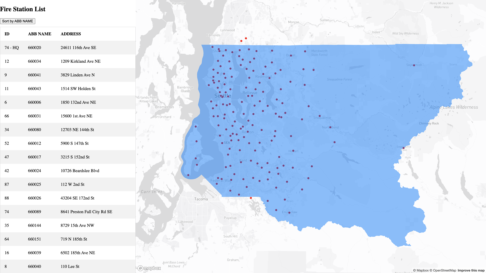
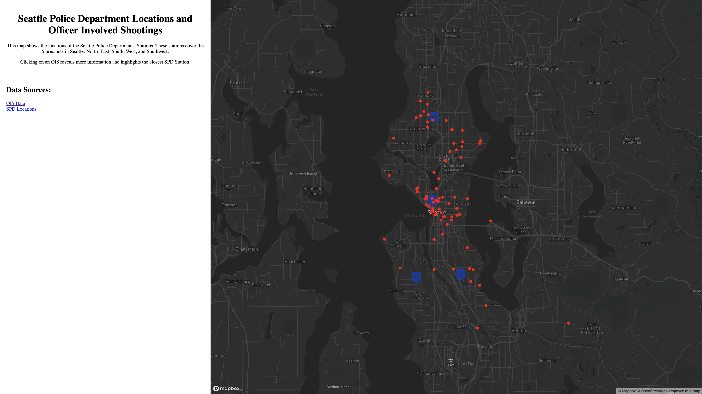

# Yi-Yang Su

[personal page](https://github.com/ivansu1999)

# Summary

This is Yi-Yang Su, currently senior year student of the University of Washington. I am refering myself for this job since I acknowlegde and skills of web designing, GIS data analysis, and finished projects of the feild.

# Experiences

## Fire Station Project

* [project link](https://ivansu1999.github.io/Fire_Stations/index.html)

**Summary of project**

    Practicing asynchronous GeoJSON data loading and visualization.

**Steps**
- List out fire stations in King County.
- Allow users to Sort the data by the ABB name.
- Showing area of the King County.
- List out address of each fire station.

## SPD and OIS Locations
* [project link](https://saffolder.github.io/SPD_OIS_locations/)

**Summary of project**

    Asynchronous GeoJSON data loading and visualization with using Turf.js for spatial analysis and statistics on web maps

**Steps**
- Get data of OIS and SPD data.
- OIS: red dot on the map.
- SPD: blue Police badge.
- Showing information of officer and subject races, fatality, and summary of each OIS.
- Utilizing turf.js method to calculate the closest SPD to the OIS position.